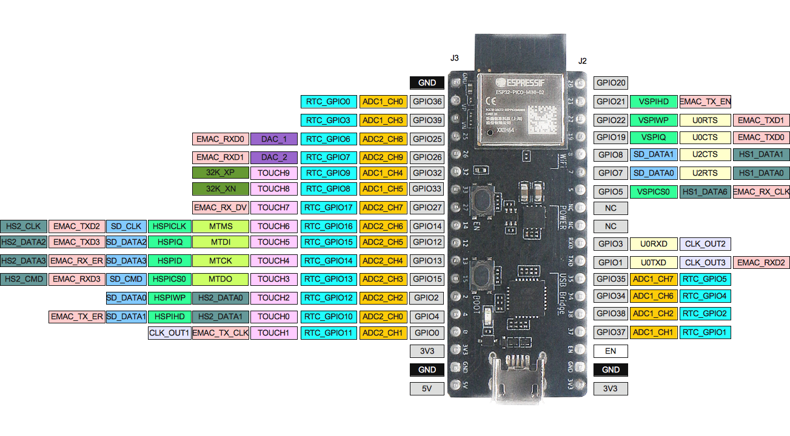

# ESP32 Development Projects 🔧

Collection of ESP32 firmware projects using ESP-IDF framework for embedded systems development.

## 📋 Overview

This repository contains ESP32 projects demonstrating firmware development, sensor interfacing, and IoT implementations. Each project includes complete source code with practical applications for embedded systems.

## 🛠️ Technical Specifications

- 💻 **Platform**: ESP32 PICO
- 🛡️ **Framework**: ESP-IDF 5.5
- 🔤 **Language**: C  
- 📝 **IDE**: nvim with ESP-IDF v5.5
- 📡 **Communication**: UART, I2C, SPI, Digital/Analog GPIO
- ⚡  **RTOS**: FreeRTOS

## 🚀 Getting Started

### 📋 Prerequisites
- **ESP-IDF v5.5** or higher
- **Python 3.6+**
- **ESP32 development board**
- **USB-to-Serial driver**

### 🔨 Build Instructions
- Navigate to project directory
- Configure project: **`idf.py menuconfig`**
- Build project: **`idf.py build`**
- Flash to ESP32: **`idf.py flash`**
- Monitor output: **`idf.py monitor`**

### 🔧 Hardware Requirements

- **ESP32 PICO development board**
- **LEDs and resistors**
- **Push buttons**
- **Breadboard and jumper wires**

## 🎯 Learning Objectives

- **ESP-IDF framework usage**
- **FreeRTOS task management**
- **GPIO and peripheral control**
- **Sensor interfacing techniques**
- **Interrupt handling**
- **OTA update implementation**
- **IoT connectivity basics**

## 📁 Project Directory
**001_hello_world** 🌟  
Basic ESP32 "Hello World" program with serial output and system initialization.

**002_LED_blink** 💡  
GPIO control demonstration with LED blinking patterns and timing control.

**003_calc** 🧮  
Simple calculator implementation with UART input handling and mathematical operations.

**004_LED** 🔆  
Advanced LED control with PWM, brightness adjustment, and GPIO management.

**005_freeRTOS** ⚡  
FreeRTOS task management, inter-task communication, and real-time scheduling examples.

**006_led_button_isr** 🔘  
Interrupt Service Routine implementation for button-controlled LED operations.

**007_dht11** 🌡️  
DHT11 temperature and humidity sensor interfacing with data validation and error handling.

**008_ir_sensor_buzzer** 🔊  
IR sensor integration with buzzer control for proximity detection and audio feedback.

**009_ir_sensor_task** 📡  
Task-based IR sensor management with FreeRTOS scheduling and event handling.

**010_pir_sensor_buzzer** 🚨  
PIR motion sensor implementation with buzzer alerts and motion detection logic.

**011_freeRTOS_Task** ⚙️  
Advanced FreeRTOS task creation, synchronization, and multi-threading demonstrations.

**012_task_notifications** 📩  
FreeRTOS task notification examples demonstrating direct-to-task signaling and lightweight inter-task communication.  

**013_ldr** 🌞  
Light Dependent Resistor (LDR) sensor interfacing with ADC input for light intensity monitoring.  

**014_Mutex** 🔒  
FreeRTOS mutex usage for safe resource sharing between multiple tasks.  

**015_Queue** 📬  
Queue-based communication between FreeRTOS tasks for structured data passing.  

**016_Hotel_system_FreeRTOS** 🏨  
Simulation of a hotel automation system using FreeRTOS tasks for lights, fans, and sensors.  

**017_timer** ⏱️  
ESP-IDF software timer usage for periodic events and task scheduling.  

**018_nvs** 💾  
Non-Volatile Storage (NVS) examples for storing and retrieving persistent data on ESP32 flash.  

**019_gpio_output** 🔌  
Basic GPIO output handling with digital pin control.  

**020_gpio_input** 🎛️  
GPIO input handling with button/switch interfacing.  

**021_uart** 🖧  
UART communication example for transmitting and receiving serial data.  

**022_uart_queue** 📤📥  
UART driver with FreeRTOS queue integration for structured serial communication.  

**023_i2c_tools_address** 🔗  
I2C communication utilities with address scanning and peripheral discovery.  

**024_i2c_oled_hello** 🖥️
Simple I2C OLED display example using SSD1306. Displays "HELLO" text on a 128x64 OLED via ESP32 I2C Master driver.

**025_oled_display_library** 📚
Reusable OLED display driver library for ESP32 with text rendering support. Encapsulates SSD1306 initialization, command handling, and text drawing into a standalone component for modular projects.

---

## 📷 Hardware Reference  

  
*ESP32 Pico DevKitM-2 Pinout Diagram for reference*

📷 Pinout image credit: Original source unknown (reference only, not for commercial use).

---
